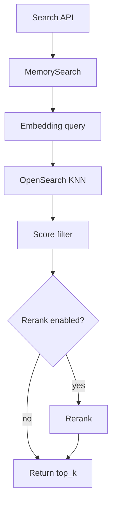
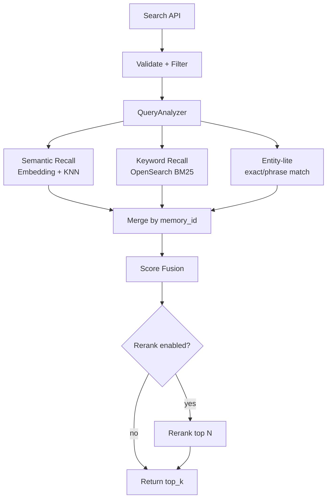
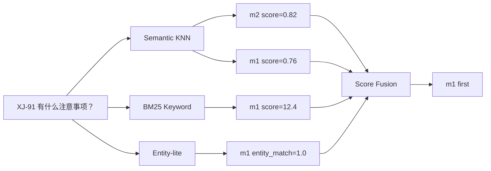
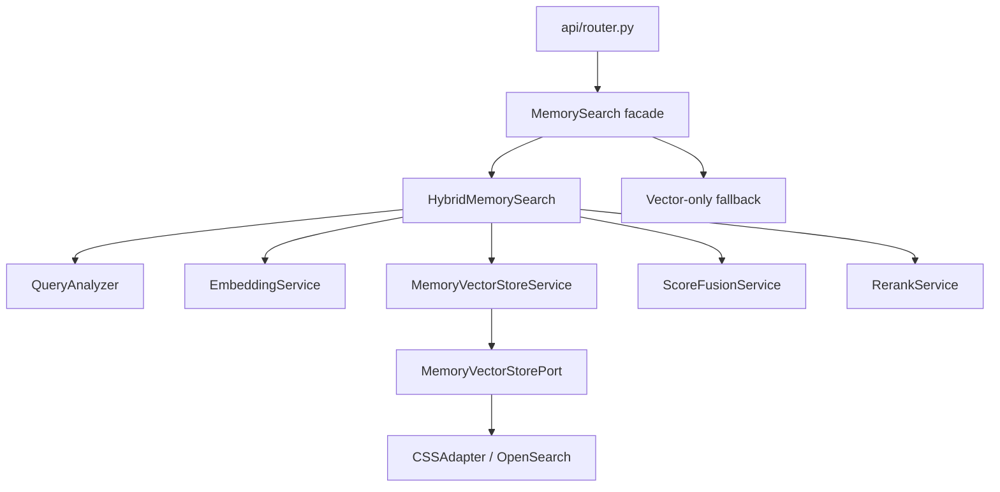
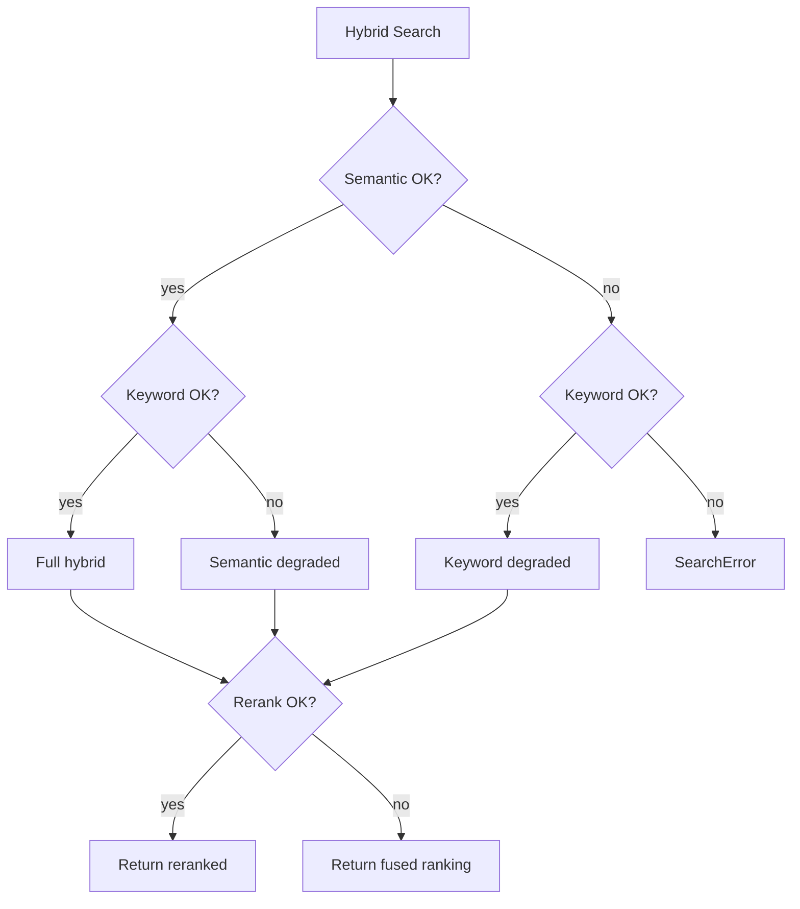
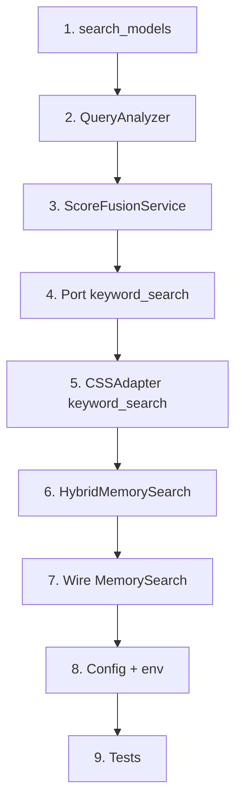

# Memory-Core 多信号混合检索设计

更新时间：2026-07-01

本文是给人和 AI coding agent 共同阅读的实现设计。先用图说明整体，再给出必要的接口、实现步骤和验收标准。

## 1. 一句话结论

当前 core search 主要靠 `embedding + OpenSearch KNN + rerank`。这对自然语言语义查询有效，但对 `XJ-91` 这种项目代号、人名、地名、产品型号、短关键词不稳定。

参考 Mem0 的多信号检索思路，第一版在不改外部 API、不重建索引、不改写入流程的前提下，把 search 改成：

```text
语义向量召回 + BM25 关键词召回 + 轻量实体命中加分 + 可选 rerank
```

核心目标：**让“语义相关”和“关键词精确命中”都能进入候选池，再统一排序。**

## 2. 当前问题

### 2.1 现在的检索链路



### 2.2 典型失败例子

记忆里有：

```text
m1: 用户正在推进 XJ-91 项目，要求暂不公开。
m2: 用户关注向量检索性能优化。
```

用户问：

```text
XJ-91 有什么注意事项？
```

只靠 embedding 时，`XJ-91` 这种代号没有稳定语义，系统可能把 m2 排到前面，因为它也有“项目 / 优化 / 注意事项”这类语义接近内容。

我们需要让 `XJ-91` 这种精确词也参与召回和排序。

## 3. 目标方案

### 3.1 新链路总览



### 3.2 每路信号负责什么

| 信号 | 解决什么问题 | 例子 |
|---|---|---|
| Semantic KNN | 语义相近但文字不同 | “饮食限制”命中“素食、坚果过敏” |
| BM25 Keyword | 精确词、代号、产品名 | `XJ-91`、`deepseek-v3.2` |
| Entity-lite | 人名、地名、项目名加分 | `Emma`、`Tokyo`、`Stanford` |
| Rerank | 对融合后候选二次排序 | top 80 候选重排 |

### 3.3 本次不做什么

第一版不做：

- 不做完整实体图谱。
- 不改 memory extraction / consolidation。
- 不做 LLM query rewrite。
- 不重建 OpenSearch index。
- 不改变 search API response schema。
- 不对普通调用方暴露 explain。

## 4. 数据流例子

Query：

```text
XJ-91 有什么注意事项？
```

QueryAnalyzer 输出：

```json
{
  "keywords": ["XJ-91", "注意事项"],
  "entities": [{"text": "XJ-91", "type": "code_or_identifier"}],
  "intent": "general"
}
```

多路召回：



融合后：

| memory | semantic | keyword | entity | fused |
|---|---:|---:|---:|---:|
| m1 | 0.76 | 1.00 | 1.00 | 0.87 |
| m2 | 0.82 | 0.00 | 0.00 | 0.45 |

最终 m1 排第一。

## 5. 架构改动

### 5.1 模块图



### 5.2 建议新增文件

```text
src/core/application/search/
  __init__.py
  search_models.py
  query_analysis.py
  score_fusion.py
  hybrid_search.py
```

需要修改：

```text
src/core/application/memory_search.py
src/core/application/services/memory_vector_store_service.py
src/core/ports/memory_vector_store.py
src/core/adapters/css_adapter.py
src/core/config.py
```

## 6. 关键契约

### 6.1 QueryAnalysis

```python
@dataclass(frozen=True)
class QueryAnalysis:
    normalized_query: str
    query_hash: str
    keywords: tuple[str, ...]
    entities: tuple[QueryEntity, ...]
    intent: str = "general"
```

注意：日志只能打 `query_hash` 和 `query_length`，不能打原始 query。

### 6.2 RecallResult

```python
class SearchSignal(str, Enum):
    SEMANTIC = "semantic"
    KEYWORD = "keyword"
    ENTITY = "entity"
    RECENCY = "recency"

@dataclass(frozen=True)
class RecallResult:
    result: SearchResult
    signal: SearchSignal
    raw_score: float
    rank: int
```

### 6.3 新增 Port 方法

在 `MemoryVectorStorePort` 增加：

```python
async def keyword_search(
    self,
    space_id: UUID,
    query: str,
    top_k: int = 10,
    filters: SearchFilters | None = None,
    boost_terms: list[str] | None = None,
) -> SearchResponse:
    ...
```

这只是存储层关键词召回能力，不要把 hybrid fusion 做进 Port。

## 7. 安全设计

安全是第一优先级。

### 7.1 多租户隔离

每一路 OpenSearch 查询都必须带：

```python
routing = str(space_id)
query_filters = [{"term": {"space_id": routing}}]
query_filters.extend(filters.to_query_filters())
```

适用于：

- KNN search
- keyword search
- 未来 entity search

### 7.2 禁止 query_string

禁止：

```json
{"query_string": {"query": "<user input>"}}
```

允许：

```json
{"match": {"content": {"query": "<user input>", "operator": "or"}}}
```

原因：`query_string` 会把用户输入当查询语法解析，有注入风险。

### 7.3 日志脱敏

禁止记录：

- 原始 query
- memory content
- JWT / token / API key
- OpenSearch 请求体

允许记录：

```text
query_hash
query_length
space_id
top_k
semantic_count
keyword_count
candidate_count
duration_ms
degraded_reason
```

### 7.4 资源保护

必须限制：

```text
max_query_length
max_top_k
max_keywords
max_entities
max_term_length
max_fusion_candidates
rerank_candidate_limit
```

## 8. OpenSearch keyword_search 设计

### 8.1 DSL

`CSSAdapter.keyword_search()` 使用结构化 DSL：

```python
body = {
    "size": top_k,
    "query": {
        "bool": {
            "filter": query_filters,
            "must": [
                {
                    "match": {
                        "content": {
                            "query": query,
                            "operator": "or",
                        }
                    }
                }
            ],
            "should": should_clauses,
        }
    },
    "_source": {"excludes": ["embedding"]},
}
```

`should_clauses` 来自 `boost_terms`：

```python
{
    "match_phrase": {
        "content": {
            "query": term,
            "boost": 4.0,
        }
    }
}
```

调用必须带 routing：

```python
await self._client.search(index=self._index_name, body=body, routing=str(space_id))
```

### 8.2 当前索引限制

当前 `content` 是 `text` 字段，可以直接 BM25 查询，不需要重建索引。

限制：

- 中文分词效果可能一般。
- 英文、数字、代号、混合 token 会先获益。
- 后续再考虑 `ngram` 或中文 analyzer。

## 9. 分数融合

### 9.1 为什么要融合

KNN score 和 BM25 score 不是一个尺度：

- KNN 通常接近 0-1。
- BM25 可能是 0-几十。
- entity 命中是 0-1。

所以不能直接相加，必须先归一化。

### 9.2 默认权重

```text
semantic_weight = 0.55
keyword_weight  = 0.25
entity_weight   = 0.15
recency_weight  = 0.05
```

V1 默认可以关闭 recency：

```text
SEARCH_HYBRID_RECENCY_ENABLED=false
```

### 9.3 融合公式

```python
fused_score = (
    semantic_weight * semantic_norm
    + keyword_weight * keyword_norm
    + entity_weight * entity_norm
    + recency_weight * recency_norm
)
```

缺失信号按 0 处理。

### 9.4 排序

建议稳定排序：

```text
fused_score desc
best signal rank asc
updated_at desc
id asc
```

## 10. 降级策略



规则：

| Semantic | Keyword | Rerank | 行为 |
|---|---|---|---|
| 成功 | 成功 | 成功 | full hybrid |
| 成功 | 成功 | 失败 | fusion fallback |
| 成功 | 失败 | 任意 | semantic degraded |
| 失败 | 成功 | 任意 | keyword degraded |
| 失败 | 失败 | 任意 | SearchError |

回滚开关：

```text
SEARCH_HYBRID_ENABLED=false
```

## 11. 配置项

建议增加到 `SearchConfig`：

```python
hybrid_enabled: bool = True
hybrid_keyword_enabled: bool = True
hybrid_entity_lite_enabled: bool = True
hybrid_recency_enabled: bool = False

hybrid_semantic_weight: float = 0.55
hybrid_keyword_weight: float = 0.25
hybrid_entity_weight: float = 0.15
hybrid_recency_weight: float = 0.05

hybrid_semantic_expansion_factor: int = 4
hybrid_keyword_expansion_factor: int = 4
hybrid_min_semantic_candidates: int = 40
hybrid_min_keyword_candidates: int = 40
hybrid_max_semantic_candidates: int = 200
hybrid_max_keyword_candidates: int = 200
hybrid_max_fusion_candidates: int = 300
hybrid_rerank_candidate_limit: int = 80

hybrid_keyword_timeout_ms: int = 2000
hybrid_vector_timeout_ms: int = 5000
hybrid_max_keywords: int = 16
hybrid_max_entities: int = 8
hybrid_max_term_length: int = 64
hybrid_default_min_score: float = 0.30
```

候选规模：

```text
semantic_k = min(max(top_k * 4, 40), 200)
keyword_k  = min(max(top_k * 4, 40), 200)
rerank_N   = min(max(top_k * 3, 20), 80)
```

## 12. 实现步骤



### 12.1 Step 1：新增 search models

新增：

```text
src/core/application/search/search_models.py
```

包含：

- `SearchSignal`
- `QueryEntity`
- `QueryAnalysis`
- `RecallResult`
- `HybridSearchCandidate`

### 12.2 Step 2：QueryAnalyzer

新增：

```text
src/core/application/search/query_analysis.py
```

职责：

- normalize query
- 生成 query_hash
- 提取 keywords
- 提取 entity-like tokens
- 粗略判断 intent

不要调用 LLM。

### 12.3 Step 3：ScoreFusionService

新增：

```text
src/core/application/search/score_fusion.py
```

职责：

- 按 memory id 合并候选
- 每路分数归一化
- 计算 entity score
- 计算 fused score
- 稳定排序

### 12.4 Step 4：扩展 Port

修改：

```text
src/core/ports/memory_vector_store.py
src/core/application/services/memory_vector_store_service.py
```

增加 `keyword_search()`。

### 12.5 Step 5：CSSAdapter 实现 keyword_search

修改：

```text
src/core/adapters/css_adapter.py
```

必须满足：

- `_require_index_ready()`
- routing
- `space_id` filter
- `filters.to_query_filters()`
- 不使用 `query_string`
- `_source.excludes=["embedding"]`
- SearchError 包装

### 12.6 Step 6：HybridMemorySearch

新增：

```text
src/core/application/search/hybrid_search.py
```

职责：

- 并发召回
- 收集降级
- 调用 fusion
- 调用 rerank
- 返回 SearchResponse

### 12.7 Step 7：接入 MemorySearch

修改：

```text
src/core/application/memory_search.py
```

逻辑：

```python
if config.hybrid_enabled:
    return await hybrid_search.search(...)
return await vector_only_search(...)
```

保留现有 blank query list fallback。

## 13. 伪代码

```python
async def search(query, space_id, top_k, min_score, filters):
    if not config.hybrid_enabled:
        return await vector_only_search(query, space_id, top_k, min_score, filters)

    analysis = query_analyzer.analyze(query)

    semantic_task = create_task(semantic_recall(analysis, space_id, top_k, filters))
    keyword_task = create_task(keyword_recall(analysis, space_id, top_k, filters))

    recalls = []
    degraded = []

    for signal, task in tasks:
        try:
            recalls.extend(await task)
        except Exception:
            degraded.append(signal)

    if not recalls:
        raise SearchError("all recall paths failed")

    candidates = score_fusion.merge_and_score(analysis, recalls, min_score)

    if config.rerank_enabled:
        try:
            return await rerank_top_candidates(query, candidates, top_k)
        except Exception:
            log_rerank_degraded()

    return top_k_by_fused_score(candidates)
```

## 14. 测试计划

### 14.1 单元测试

QueryAnalyzer：

- `XJ-91 有什么注意事项` 能提取 `XJ-91`
- `deepseek-v3.2` 能提取模型名
- 恶意形态 query 不会被解释成 DSL
- keyword/entity 数量限制生效

ScoreFusionService：

- semantic-only 可排序
- keyword-only 可排序
- 同一条 memory 多路命中时分数更高
- entity 命中加分
- min_score 生效
- 排序稳定

CSSAdapter.keyword_search：

- 带 routing
- 带 `space_id` filter
- 带用户 filters
- 不返回 embedding
- 不使用 `query_string`

### 14.2 集成测试

场景 1：项目代号

```text
memory A: 用户正在推进 XJ-91 项目，要求暂不公开。
memory B: 用户关注向量检索性能优化。
query: XJ-91 有什么注意事项？
expected: A ranked first
```

场景 2：多租户隔离

```text
space A: XJ-91 secret
space B: XJ-91 public
query in space A
expected: only space A result
```

场景 3：降级

- keyword search 失败时 semantic 仍返回。
- rerank 失败时 fusion 仍返回。
- hybrid disabled 时不调用 keyword_search。

### 14.3 安全测试

Query：

```text
*) OR *:* OR content:*
content:(secret)
" OR "1"="1
```

预期：

- 不使用 `query_string`
- 不跨租户
- 不泄漏 OpenSearch 原始错误
- 日志不出现原始 query / content

## 15. 验收标准

功能：

- hybrid search 能返回合法 `SearchResponse`
- hybrid disabled 等价当前 vector-only
- `XJ-91` 这类精确 token 能提升召回
- rerank 失败不影响返回
- keyword 失败不影响 semantic 返回

安全：

- 每一路查询都有 `space_id` filter 和 routing
- 不使用 `query_string`
- 日志无原始 query/content/token
- 多租户和 actor/session 过滤测试通过

性能：

- semantic/keyword 并发执行
- candidate 数量有上限
- rerank 输入有上限
- OpenSearch 不返回 embedding 字段

可维护：

- QueryAnalyzer、ScoreFusionService 有独立测试
- CSSAdapter 不包含 fusion 策略
- 配置项命名清晰
- 保留 vector-only fallback

## 16. 上线与回滚

推荐上线：

1. 代码合入时先 `SEARCH_HYBRID_ENABLED=false`
2. staging 打开 hybrid
3. 跑项目代号、普通语义、多租户隔离测试
4. 观察 p50/p95、degraded rate、rerank 失败率
5. 生产灰度开启

回滚：

```text
SEARCH_HYBRID_ENABLED=false
```

V1 不需要索引迁移，所以回滚不需要处理 OpenSearch schema。

## 17. 后续演进

V1 稳定后再考虑：

- `content.ngram` 或中文 analyzer
- 独立 entity index
- event_time / valid_from / valid_until
- internal-only search explain
- strategy-aware retrieval policy
- 离线检索质量评估集

## 18. 给 AI 实现时的重点提醒

1. 先读现有 search 和 CSSAdapter 代码。
2. 不要改外部 API response schema。
3. 不要删除 vector-only 路径。
4. 不要削弱 `space_id` routing/filter。
5. 不要使用 OpenSearch `query_string`。
6. 不要记录原始 query 和 memory content。
7. 每个新增类保持职责单一。
8. 先实现 keyword BM25 + fusion，entity index 留到后续。
